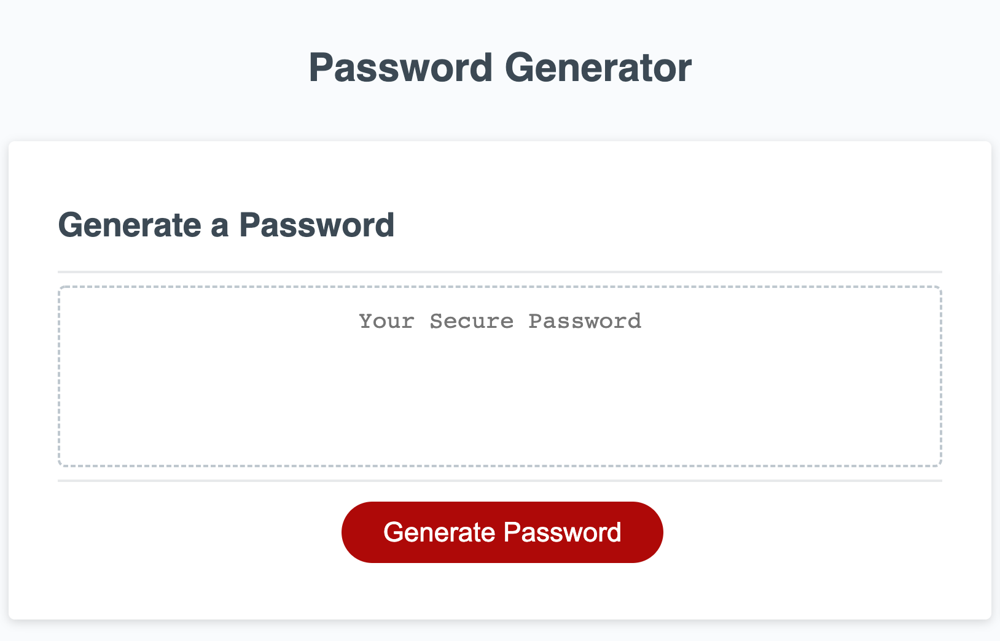

# Password 
## Description: A random password generator website, with prompts letting users decide which criterias to include in the password. Criterias included: 
(1) Password length
(2) Upper vs. lower case
(3) Should numeric characters be included?
(4) Should special characters be included?

## Usage
### Brief look of the site:

### How it works:
When users click the red "Generate Password" button, window prompts will pop-up, with questions regarding what criteria users want to include in their password. Once users have gotten through all the prompts, a randomly generated password that fulfills all their criterias will pop up in the box

## Website link:
https://phuonghoang68.github.io/Password-generator/

